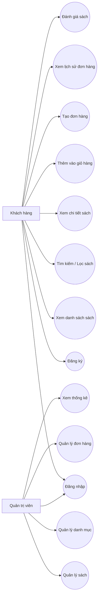
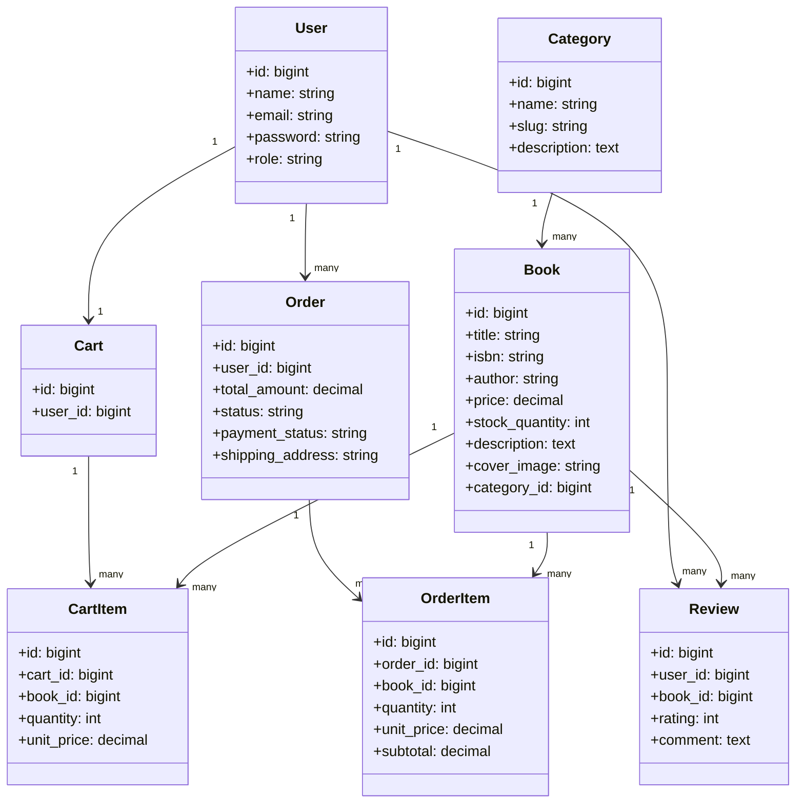
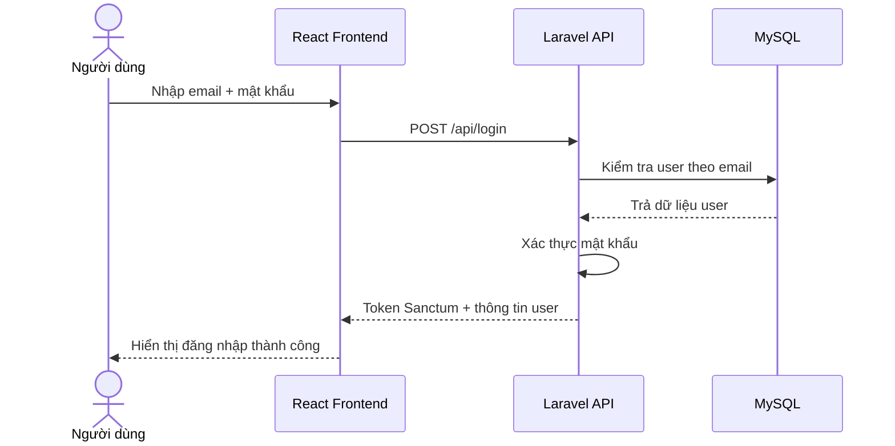
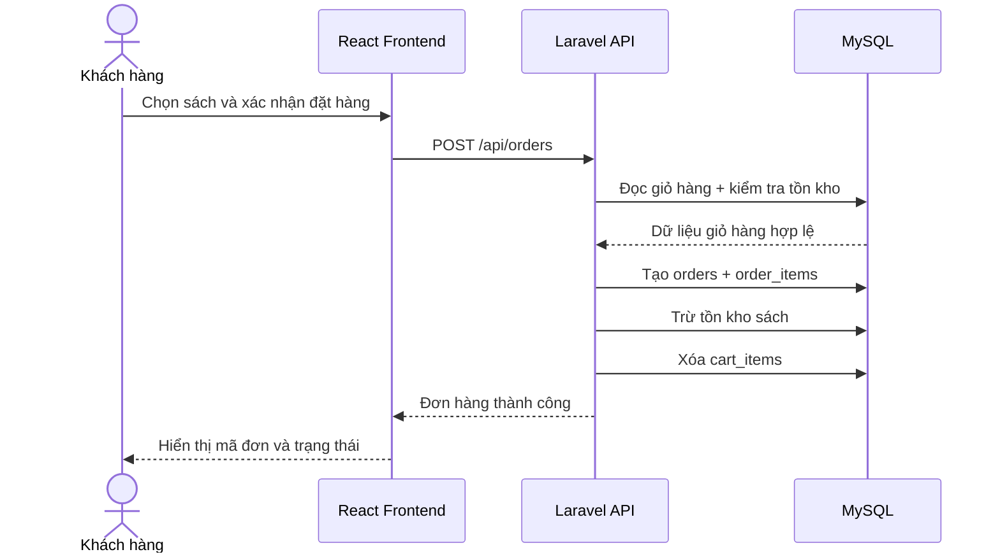
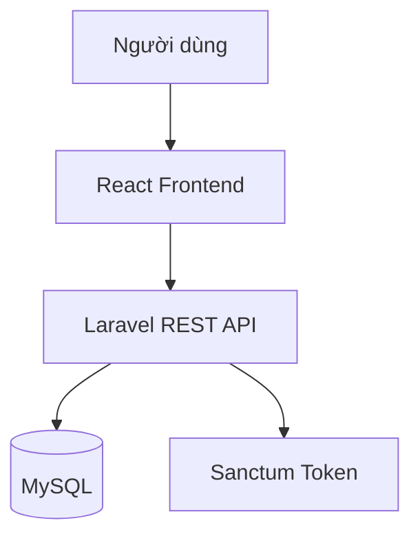

# Sơ đồ Use Case, Lớp, Tuần tự

## 1. Use Case tổng quát

## 2. Sơ đồ lớp

## 3. Sơ đồ tuần tự: Đăng nhập

## 4. Sơ đồ tuần tự: Đặt hàng

## 5. Thiết lập môi trường đề xuất

- PHP >= 8.2
- Composer
- Node.js >= 18
- MySQL >= 8
- Laragon hoặc XAMPP
- VS Code
- Postman

## 6. Kiến trúc triển khai

